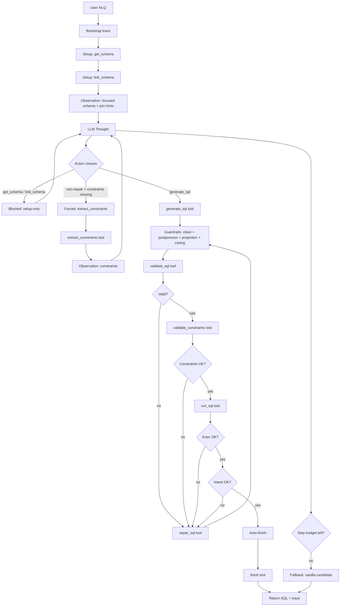

# ReAct Loop Diagram (Tool-Driven NL->SQL)

This file keeps a single high-level diagram for explaining the tool-driven ReAct loop used in evaluation.

- Authoritative loop: `notebooks/03_agentic_eval.ipynb` (`react_sql`)
- Tool interface: `nl2sql/agent_tools.py`

