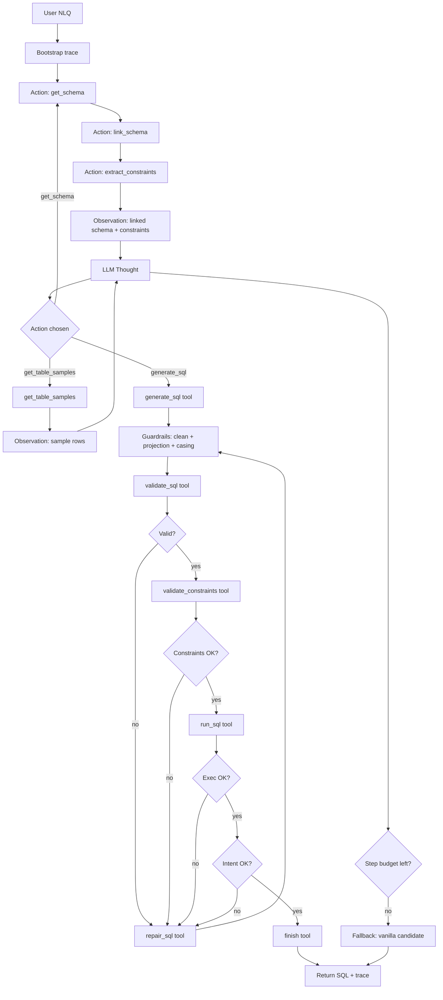
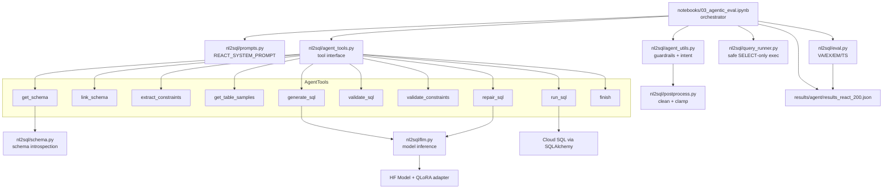
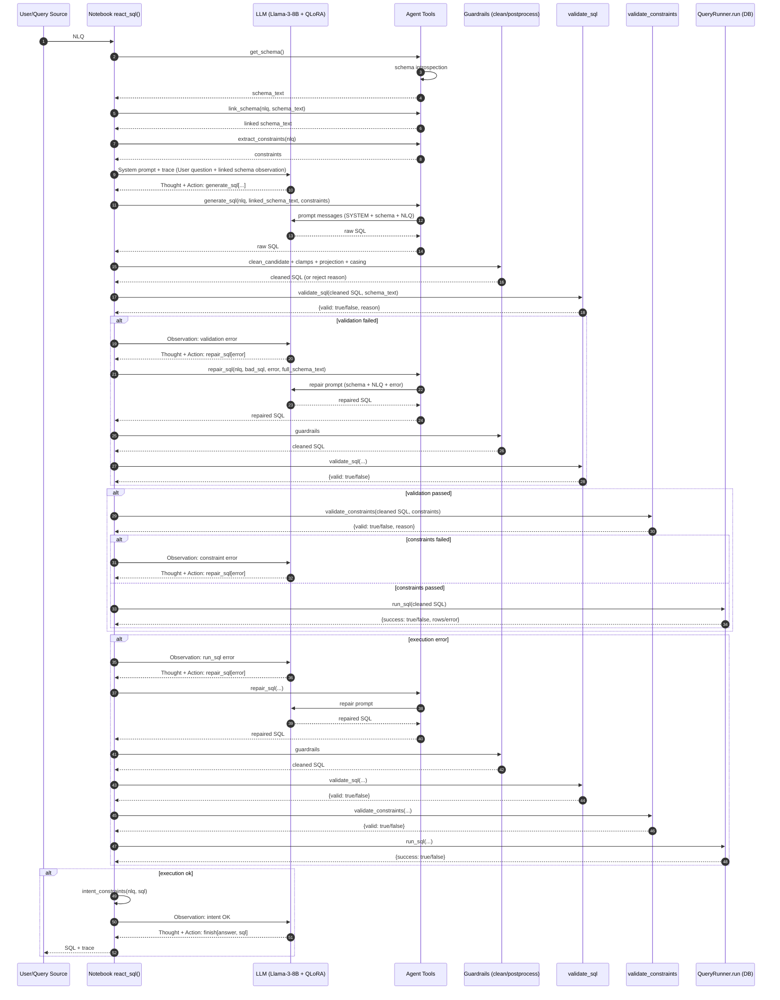
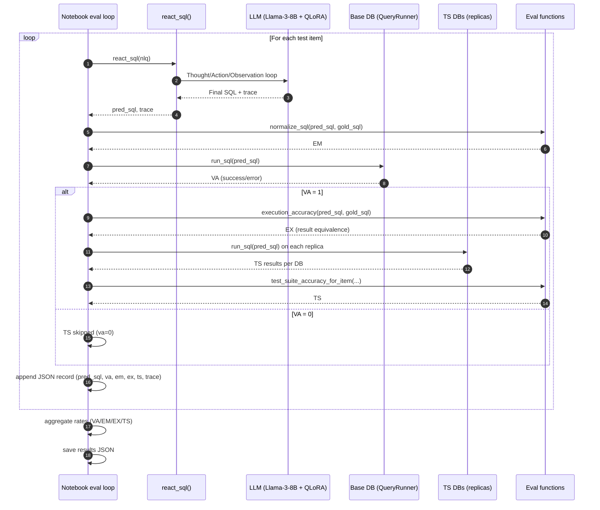
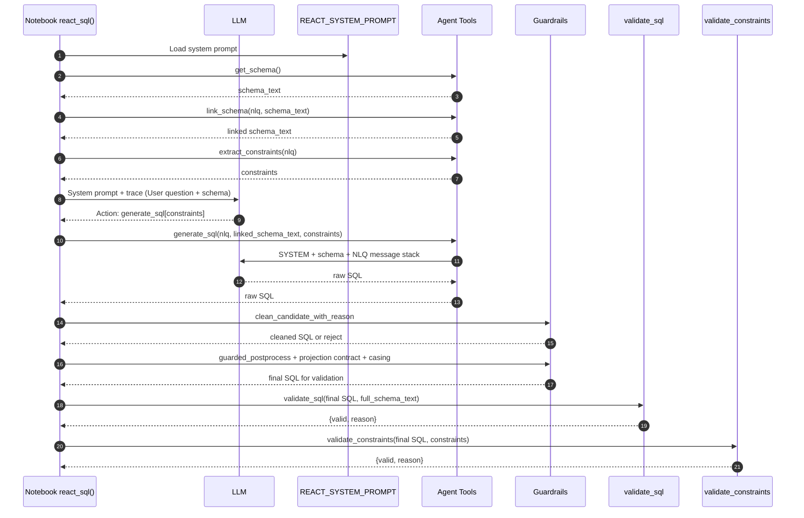

# ReAct Loop Diagrams (Tool‑Driven NL→SQL)

This file collects the diagrams used to explain the tool‑driven ReAct loop, the experimental methodology, and the code flow. The diagrams map directly to the current implementation in `notebooks/03_agentic_eval.ipynb` and the tool interface in `nl2sql/agent_tools.py`.

---

**Conceptual ReAct Loop (Tool‑Driven, Validation + Execution Feedback)**

Note: validation/execution/constraint failures force `repair_sql` in the implementation, and trace summaries log action order and compliance.



---

**Methodology Pipeline (Literature‑Aligned Evaluation)**

```mermaid
flowchart LR
  subgraph Data
    DB[ClassicModels DB]
    Train[Train JSONL]
    Test[Test JSON]
  end

  subgraph Methods
    BL[Baseline ICL Prompting]
    FT[QLoRA Fine‑Tuning]
    RA[Tool‑Driven ReAct Loop\n(Validate → Run → Repair)]
  end

  subgraph Evaluation
    VA[VA: Valid SQL]
    EM[EM: Exact Match]
    EX[EX: Execution Accuracy]
    TS[TS: Test‑Suite Accuracy]
  end

  Train --> FT
  DB --> BL
  DB --> RA
  DB --> VA
  DB --> EX
  DB --> TS
  Test --> VA
  Test --> EM
  Test --> EX
  Test --> TS

  BL --> VA
  BL --> EM
  BL --> EX
  BL --> TS

  FT --> VA
  FT --> EM
  FT --> EX
  FT --> TS

  RA --> VA
  RA --> EM
  RA --> EX
  RA --> TS

  VA --> COMP[Compare Methods]
  EM --> COMP
  EX --> COMP
  TS --> COMP
  COMP --> REPORT[Results + Analysis]
```

---

**Code Flow (Module‑Level Implementation)**



---

**Sequence Diagram: Tool‑Driven ReAct Loop (Per Query)**



---

**Sequence Diagram: Full Evaluation Run (VA/EX/EM/TS)**



---

**Sequence Diagram: Prompt Construction + Guardrails**



---

**Code Pointers**
- `notebooks/03_agentic_eval.ipynb` (tool‑driven `react_sql` loop, trace logging, evaluation loop)
- `nl2sql/agent_tools.py` (`get_schema`, `link_schema`, `extract_constraints`, `get_table_samples`, `generate_sql`, `validate_sql`, `validate_constraints`, `run_sql`, `repair_sql`, `finish`)
- `nl2sql/prompts.py` (`REACT_SYSTEM_PROMPT`)
- `nl2sql/agent_utils.py` (guardrails, intent constraints, cleaners)
- `nl2sql/postprocess.py` (deterministic SQL clamps and normalization)
- `nl2sql/llm.py` (generation wrapper, SELECT extraction)
- `nl2sql/query_runner.py` (SELECT‑only execution gate)
- `nl2sql/eval.py` (VA/EX/EM/TS)
- `data/classicmodels_test_200.json` (evaluation items)

---

**Literature Anchors**
- ReAct loop: `REFERENCES.md#ref-yao2023-react`
- Agent‑mediated NL→SQL workflow: `REFERENCES.md#ref-ojuri2025-agents`
- Execution feedback: `REFERENCES.md#ref-zhai2025-excot`
- Execution‑based evaluation and TS: `REFERENCES.md#ref-zhong2020-ts`
- Benchmark context for EM limitations: `REFERENCES.md#ref-yu2018-spider`

---

**Decision Log (Demo‑Friendly Format)**

The notebook prints a compact, reasoned decision log per query, e.g.:

```
[step -1] get_schema — loaded schema (ok)
  data: {"tables": ["customers", "orders", ...]}
[step -1] link_schema — prune schema context (ok)
  data: {"schema_text": "...", "changed": true}
[step 0] extract_constraints — heuristic extraction (ok)
  data: {"agg": "COUNT", "limit": 10, ...}
[step 0] generate_sql — model generation (ok)
  data: {"raw_sql": "SELECT ..."}
[step 0] guardrails — cleaned (ok)
  data: {"cleaned_sql": "SELECT ..."}
[step 0] validate_sql — ok (ok)
[step 0] validate_constraints — ok (ok)
[step 0] run_sql — execute (ok)
  data: {"success": true, "rowcount": 10}
[step 0] intent_check — ok (ok)
[step 0] finish — completed (ok)
```

This makes each decision and its justification visible for demos and dissertation narratives.
