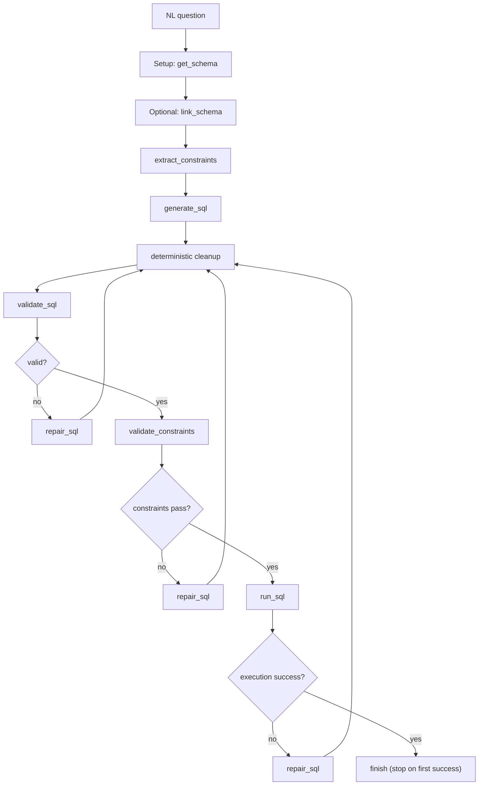
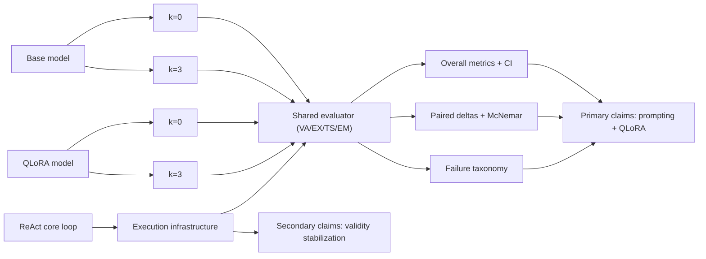

# ReAct Infrastructure Diagrams

These diagrams intentionally show ReAct as execution infrastructure supporting the primary research comparisons.

## Core Execution Loop (Minimal Default)

## Dissertation Evaluation Structure

## Reading Guide for Viva

- Left-to-right in the second diagram: controlled method comparisons.
- ReAct is shown as a separate lane to prevent overclaiming.
- Claims should come from paired deltas and error shifts, not from single-run percentages alone.
