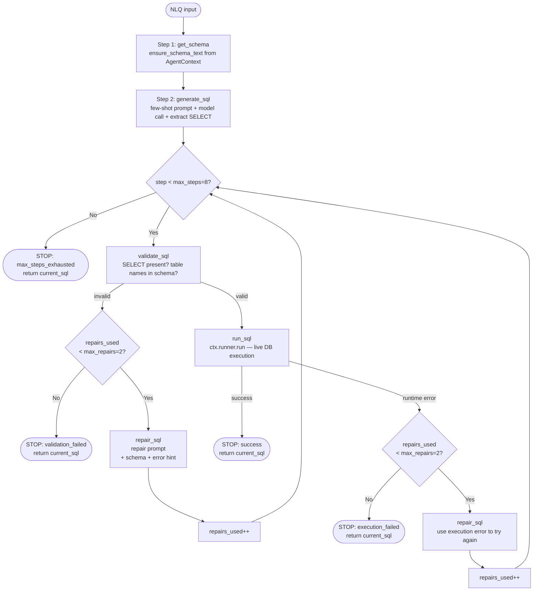
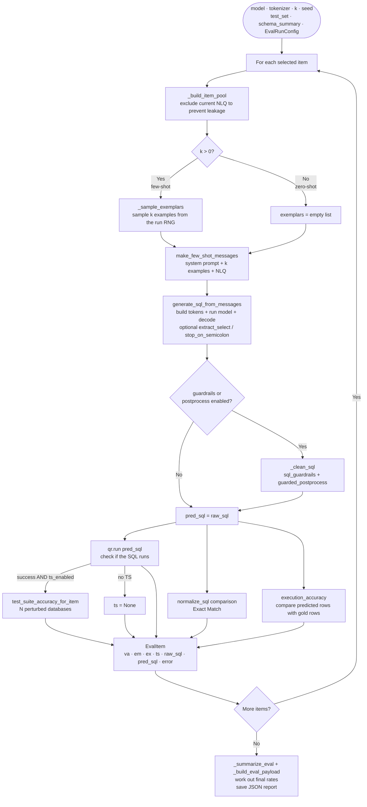
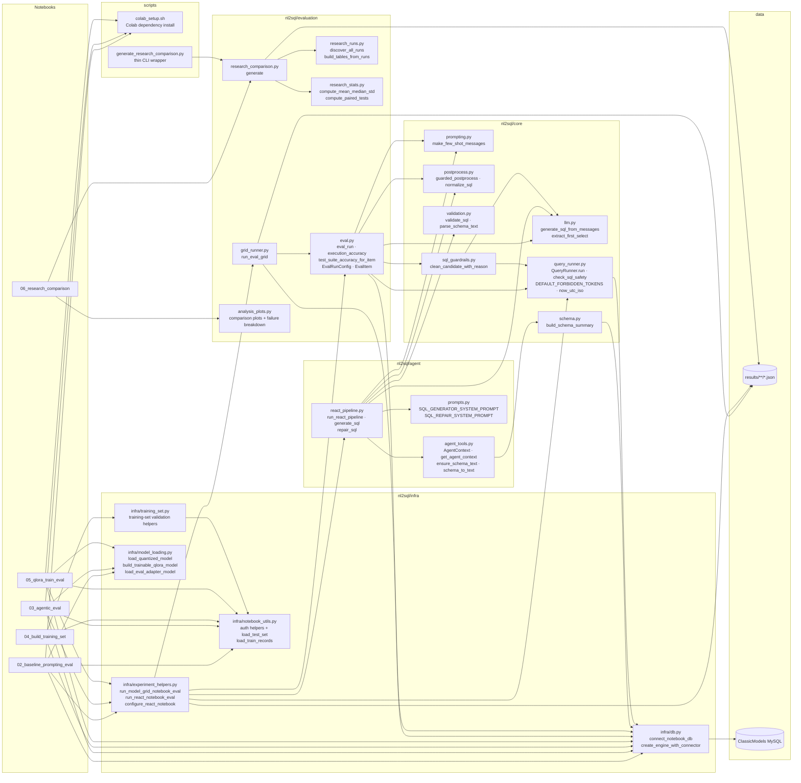
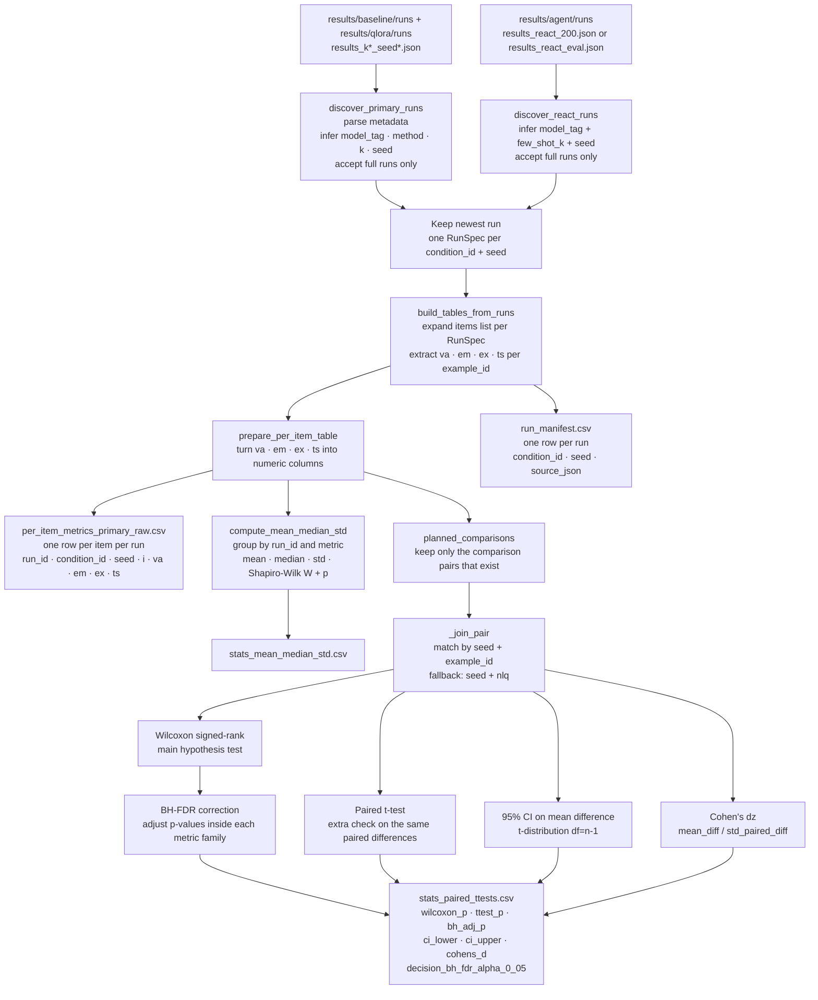
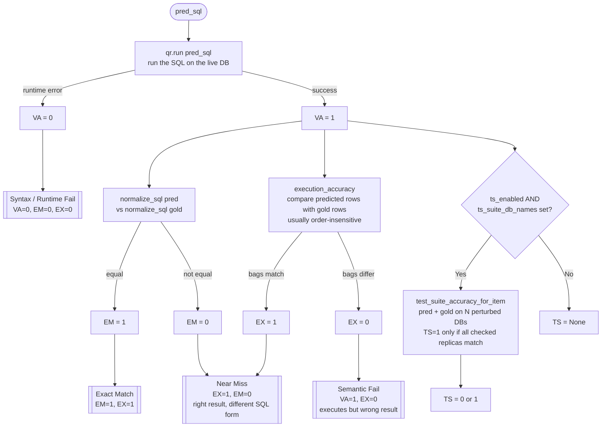
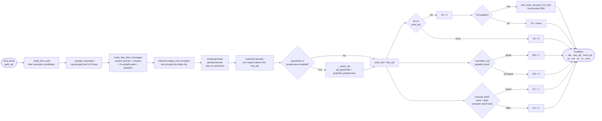

# System Diagrams

Six Mermaid diagrams that explain the project in a simple way.
Paste each fenced block into your document tool or a Mermaid live renderer.

---

## 1. ReAct Loop — `run_react_pipeline`

This is the main loop the agent follows for one question.
Each box is one step saved into the JSON trace.
`repairs_used` is one shared repair budget for both validation and execution fixes.

---

## 2. Evaluation Pipeline — `eval_run`

One full pass over the benchmark items for one setting (model × k × seed).

---

## 3. Module Architecture

High-level file map. Arrows show the main imports.

---

## 4. Statistical Analysis Pipeline — `research_comparison.generate`

How saved result files turn into summary tables and test results.

---

## 5. Metric Scoring and Failure Taxonomy

How VA, EM, EX, and TS are worked out for one prediction.

---

## 6. Single NLQ Data Flow

What happens to one benchmark question in the shared baseline/QLoRA evaluation path.

