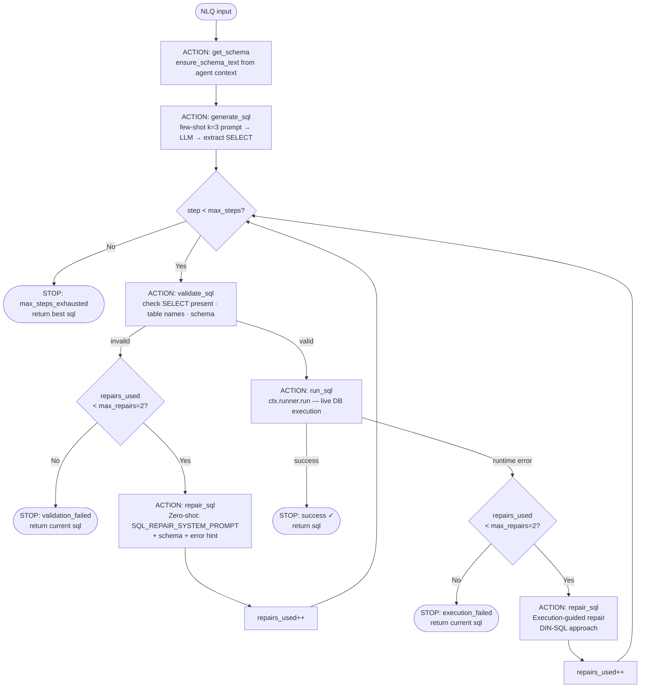
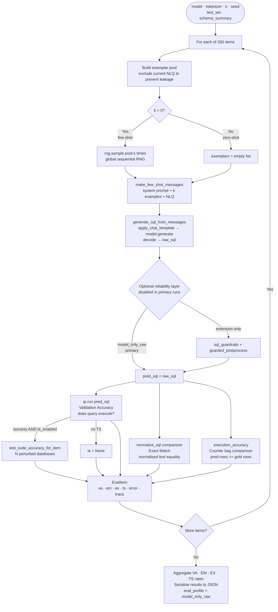
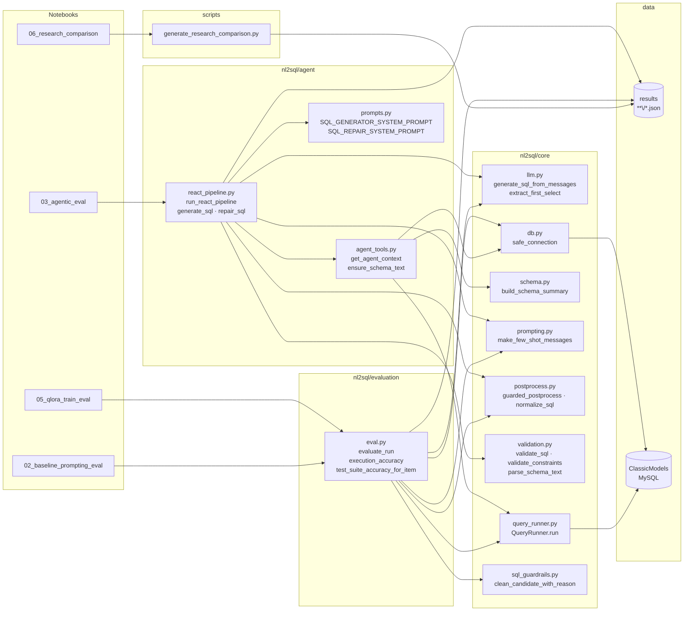
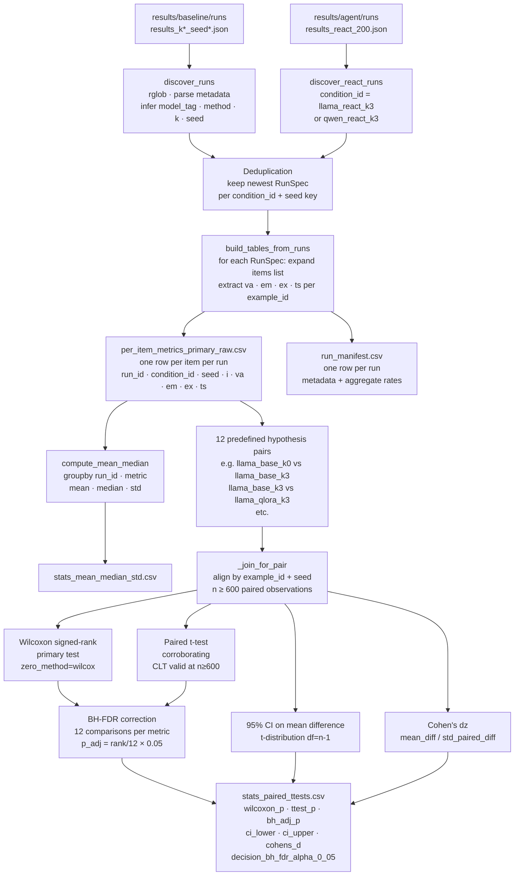
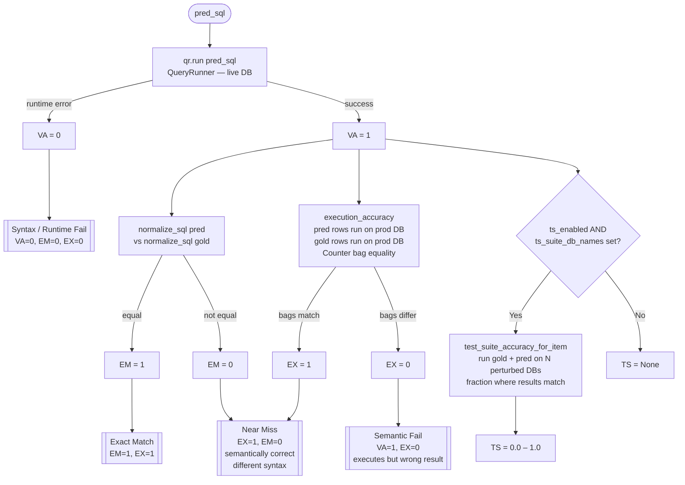

# System Diagrams

Five Mermaid diagrams for the dissertation technical explanation.
Paste each fenced block into your LaTeX/Word tool or a Mermaid live renderer.

---

## 1. ReAct Loop — `run_react_pipeline`

The Action→Observation cycle from Yao et al. (2023).
Each box is one traced step recorded in the JSON trace list.
Repair budget is shared across all repair types (max_repairs=2).

---

## 2. Baseline Evaluation Pipeline — `evaluate_run`

One full pass over the 200-item benchmark for a single condition (model × k × seed).

---

## 3. Module Architecture

Static dependency map across the `nl2sql` package, notebooks, and scripts.

---

## 4. Statistical Analysis Pipeline — `generate_research_comparison.py`

Run discovery → per-item metrics → hypothesis tests → corrected decisions.

---

## 5. Metric Scoring and Failure Taxonomy

How VA, EM, EX, and TS are computed for each prediction, and the resulting failure classes.

