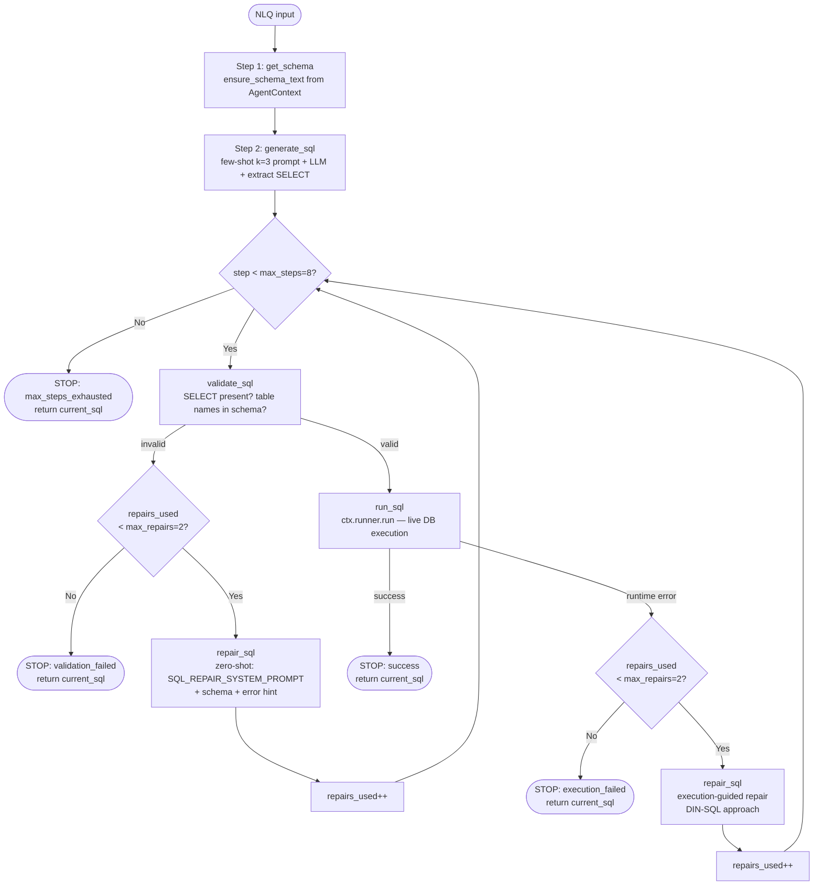
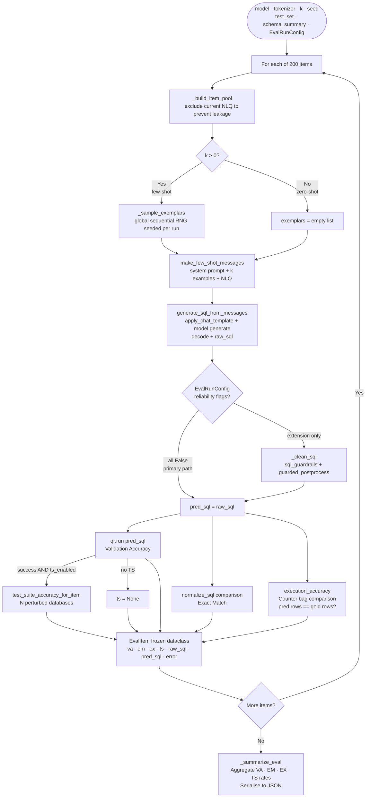
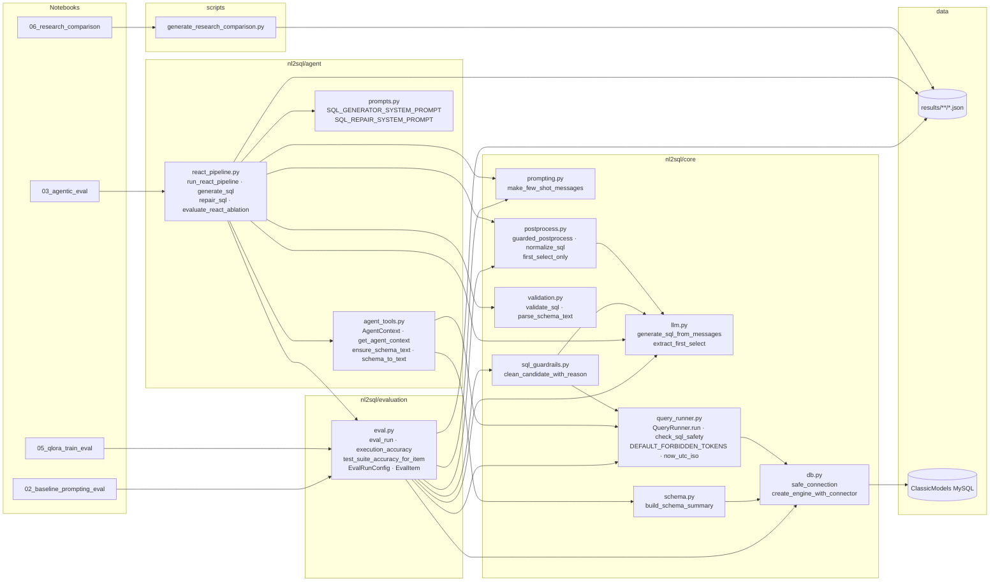
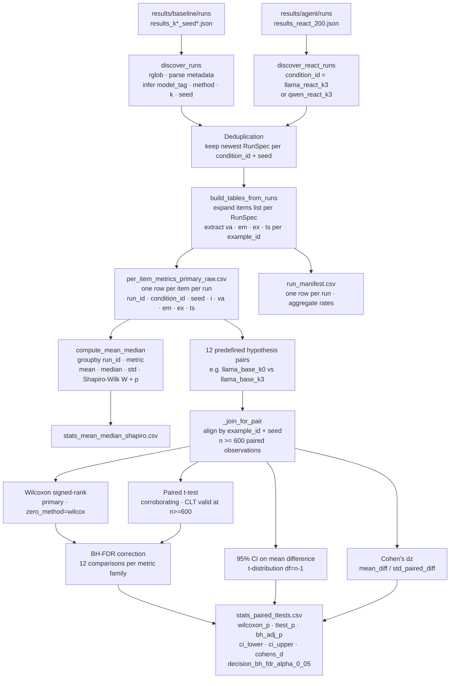
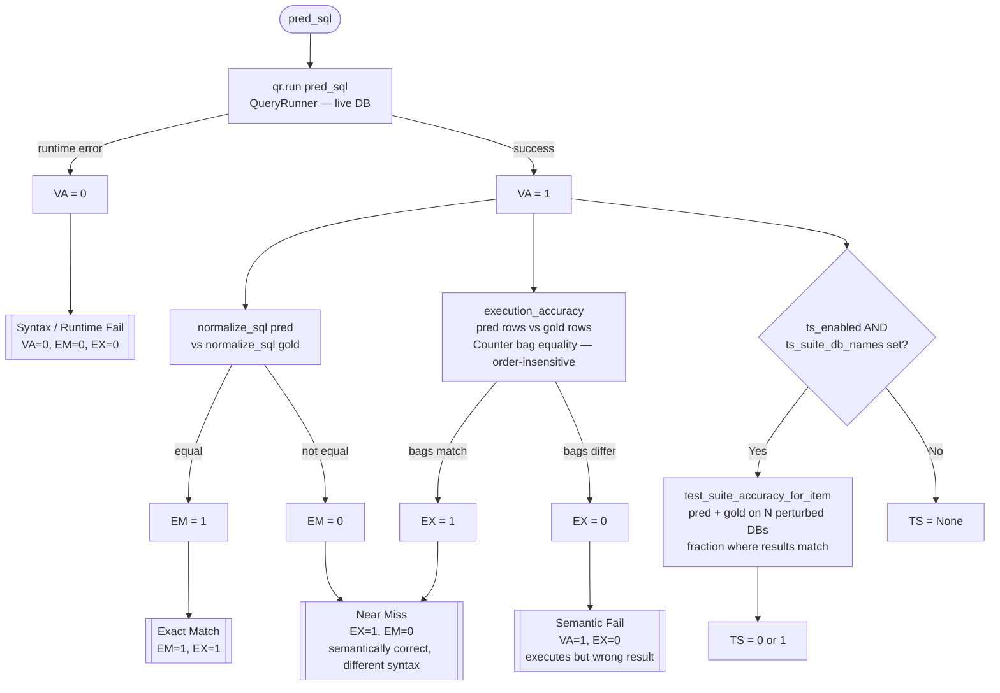
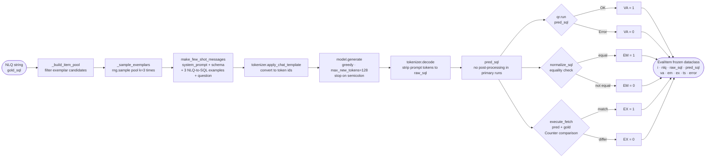

# System Diagrams

Six Mermaid diagrams for the dissertation technical explanation.
Paste each fenced block into your LaTeX/Word tool or a Mermaid live renderer.

---

## 1. ReAct Loop — `run_react_pipeline`

The Reason→Act→Observe cycle from Yao et al. (2023).
Each box is one traced step recorded in the JSON trace list.
`repairs_used` is a single shared budget across validation and execution repairs (max_repairs=2).

---

## 2. Baseline Evaluation Pipeline — `eval_run`

One full pass over the 200-item benchmark for a single condition (model × k × seed).

---

## 3. Module Architecture

Static dependency map — arrows show imports.

---

## 4. Statistical Analysis Pipeline — `generate_research_comparison.py`

Run discovery → per-item metrics → hypothesis tests → corrected decisions.

---

## 5. Metric Scoring and Failure Taxonomy

How VA, EM, EX, and TS are computed for each prediction.

---

## 6. Single NLQ Data Flow

End-to-end journey of one test item through the baseline evaluation path.

