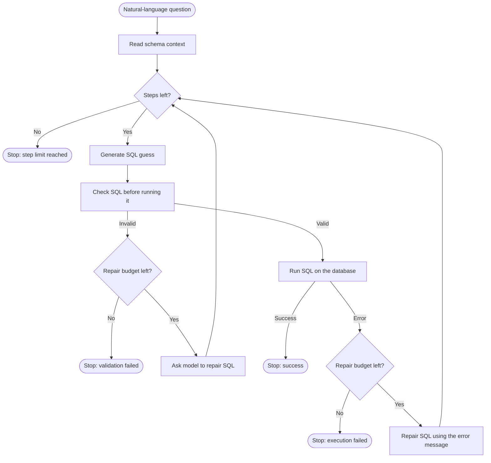
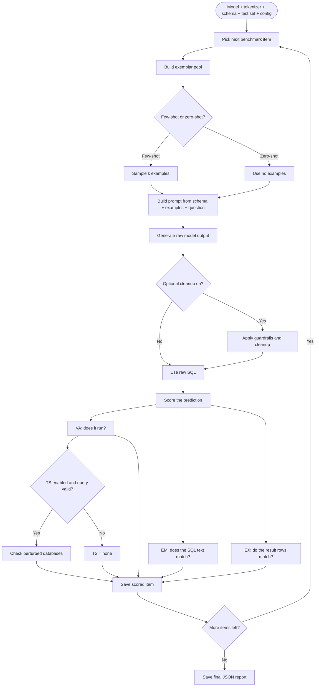
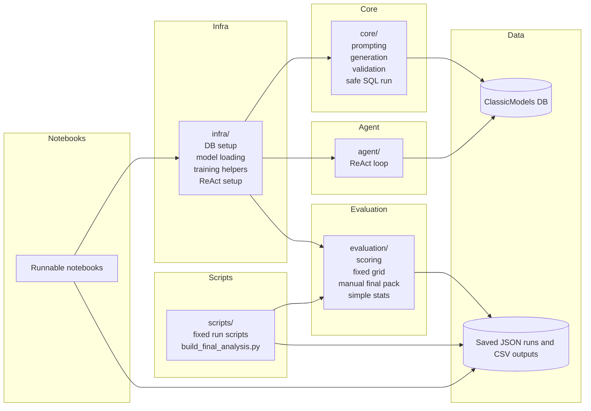
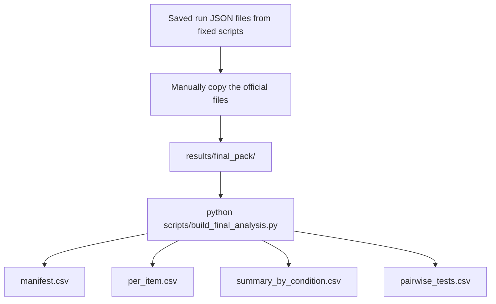
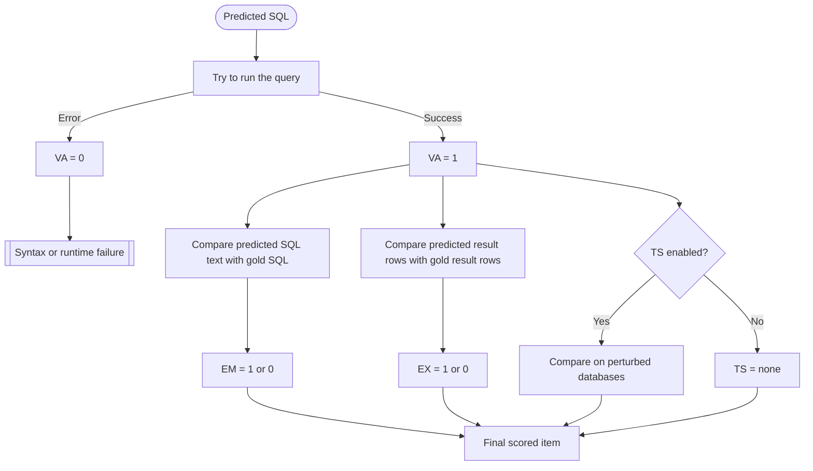
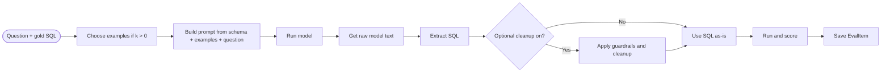

# System Diagrams

Six Mermaid diagrams written to be easy to explain in a viva or demo.
They keep the current code structure, but use plainer labels.

---

## 1. ReAct Loop

This is the main ReAct-style loop for one question.
The simple story is: get context, try SQL, check it, run it, repair if needed.

---

## 2. Evaluation Flow

This is one full evaluation run for one condition, such as one model with one `k` and one seed.

---

## 3. Project Structure

This is the repo at a high level.
The main mental model is: scripts are the official rerun path, notebooks mirror that path for walkthroughs, and one build script turns the manual final pack into the final CSV tables.

---

## 4. Two-Stage Analysis

This is the final analysis path.
The key idea is: choose the official JSON files by hand, then let one script build the final CSV tables.

---

## 5. Metric Logic

This shows how one prediction is judged.
VA is the easiest check, EM is the strict text check, EX is the main semantic check, and TS is the stricter robustness check.

---

## 6. Single Question Path

This is the baseline or QLoRA path for one benchmark question.
The short version is: build prompt, get SQL, clean it if needed, score it, save it.

